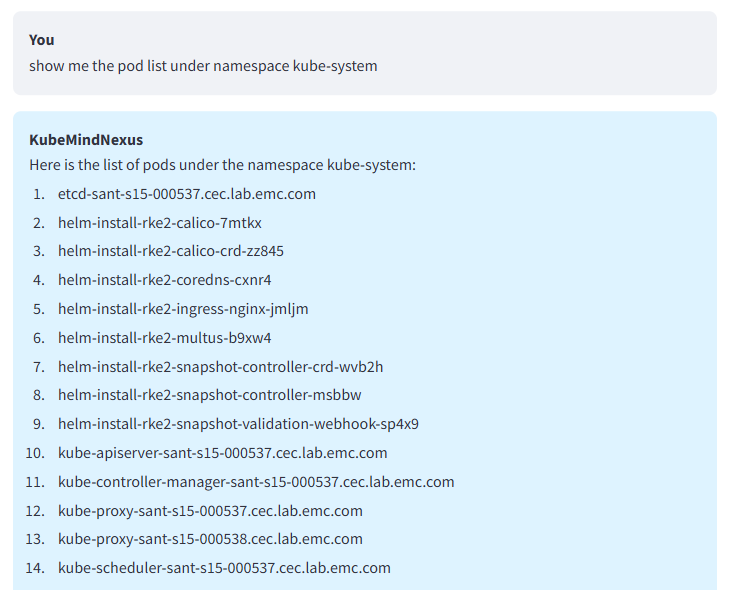
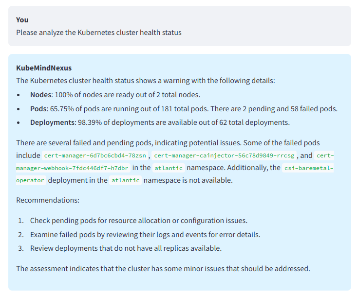
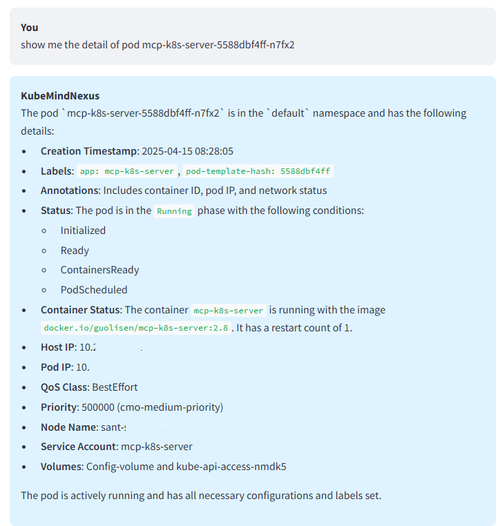

# KubeMindNexus

Kubernetes clusters management with Model Context Protocol (MCP)

## Overview

KubeMindNexus is a comprehensive Kubernetes cluster management platform that leverages Large Language Models (LLMs) through the Model Context Protocol (MCP) to provide intelligent monitoring, analysis, and management capabilities for Kubernetes clusters.

The application connects to multiple clusters and their associated MCP servers, enabling natural language interactions to monitor cluster health, analyze performance, and handle common Kubernetes administration tasks.

## Features

- **Multi-Cluster Management**: Register and manage multiple Kubernetes clusters
- **MCP Server Integration**: Connect to cluster-specific and local MCP servers
- **LLM-Powered Interaction**: Chat with multiple LLM providers (OpenAI, Ollama, Deepseek, OpenRouter)
- **ReAct Pattern**: Implements the Reasoning and Acting (ReAct) pattern for tool usage
- **Web UI and API**: Streamlit-based UI and FastAPI-based REST API
- **Performance Monitoring**: Visual representations of cluster metrics
- **Configurable**: Easily extensible with new MCP servers and LLM providers

## Examples
### Ex.1


### Ex.2


### Ex.3


## Architecture

KubeMindNexus consists of:

1. **Core Engine**:
   - Database management (SQLite)
   - Configuration management
   - MCP Hub for server connections
   - LLM integration with ReAct loop

2. **Interface**:
   - REST API (FastAPI)
   - Web UI (Streamlit)

3. **MCP Servers** (two sets):
   - Cluster-specific MCP servers (e.g., mcp_k8s_server, mcp_lcu_server)
   - Local utility MCP servers (e.g., web search, git operations)

## Installation

### Prerequisites

- Python 3.9+
- uv (Python packaging tool)
- Kubernetes clusters to monitor
- MCP servers for your clusters

### Setup

1. Clone the repository:
   ```bash
   git clone https://github.com/username/KubeMindNexus.git
   cd KubeMindNexus
   ```

2. Create a virtual environment:
   ```bash
   uv venv
   source .venv/bin/activate  # On Windows: .venv\Scripts\activate
   ```

3. Install dependencies:
   ```bash
   uv pip install -e .
   ```

4. Initialize the database:
   ```bash
   mkdir -p ~/.config/kubemindnexus
   ```

## Configuration

KubeMindNexus uses a configuration file located at `~/.config/kubemindnexus/config.json`. You can specify a different location with the `--config` command-line option.

Example configuration:

```json
{
  "db_path": "~/.config/kubemindnexus/kubemindnexus.db",
  "system_prompt_template": "You are KubeMindNexus, an AI assistant specialized in Kubernetes cluster management.\nYou have access to the following tools:\n\n{available_tools}\n\nCurrent cluster context: {cluster_context}\n\nAlways respond in a helpful, concise manner focused on Kubernetes management tasks.",
  "react_max_iterations": 5,
  "react_safety_timeout": 60,
  "ui_port": 8501,
  "api_host": "127.0.0.1",
  "api_port": 8000,
  "default_mcp_servers": [],
  "llm": {
    "default_provider": "openai",
    "providers": {
      "openai": {
        "model": "gpt-4o",
        "api_key": "",
        "base_url": "https://api.openai.com/v1",
        "parameters": {
          "temperature": 0.7,
          "max_tokens": 1000
        }
      },
      "ollama": {
        "model": "llama3",
        "base_url": "http://localhost:11434",
        "parameters": {
          "temperature": 0.7,
          "num_predict": 1000
        }
      },
      "deepseek": {
        "model": "deepseek-chat",
        "api_key": "",
        "base_url": "https://api.deepseek.com/v1",
        "parameters": {
          "temperature": 0.7,
          "max_tokens": 1000
        }
      },
      "openrouter": {
        "model": "anthropic/claude-3-opus",
        "api_key": "",
        "base_url": "https://openrouter.ai/api/v1",
        "parameters": {
          "temperature": 0.7,
          "max_tokens": 1000
        }
      }
    }
  }
}
```

### LLM Configuration

The `llm` section of the configuration allows you to configure multiple LLM providers:

- `default_provider`: The default LLM provider to use
- `providers`: Configuration for each supported LLM provider

For each provider, you can configure:
- `model`: The model name to use
- `api_key`: Your API key (can also be provided via environment variables)
- `base_url`: API endpoint URL (useful for self-hosted or proxied services)
- `parameters`: Provider-specific parameters like temperature and token limits

#### Setting API Keys

You can set API keys in three ways:

1. **Environment Variables**: Set environment variables like `OPENAI_API_KEY`, `DEEPSEEK_API_KEY`, or `OPENROUTER_API_KEY`

2. **Configuration File**: Add your API keys directly to the config.json file

3. **Helper Script**: Use the provided helper script:
   ```bash
   ./set_llm_api_key.py openai "your-api-key-here"
   ```

   Available providers: `openai`, `deepseek`, `openrouter`, `ollama`
   
   Note: For Ollama, which runs locally, you typically don't need an API key.

## Usage

### Starting the Application

There are two ways to run KubeMindNexus:

#### Option 1: Using the package with -m flag (Recommended)

```bash
python -m kubemindnexus
```

Or with custom options:

```bash
python -m kubemindnexus --api-port 8080 --ui-port 8502 --debug
```

This method works because of the `__main__.py` file within the kubemindnexus package.

#### Option 2: Using main.py directly

```bash
python main.py
```

Or with custom options:

```bash
python main.py --api-port 8080 --ui-port 8502 --debug
```

Both methods are functionally equivalent and pass command-line arguments to the same entry point.

### Web UI

Once started, the Streamlit UI is available at http://localhost:8501/ (or the configured port).

The UI has three main sections:
1. **Chat**: Interact with the LLM and issue commands
2. **Clusters**: View and manage Kubernetes clusters
3. **MCP Servers**: Configure and connect to MCP servers

### API

The REST API is available at http://localhost:8000/ (or the configured port).

API endpoints include:
- `/api/clusters` - Cluster management
- `/api/mcp-servers` - MCP server management
- `/api/chat` - Chat endpoints
- `/api/llm-config` - LLM configuration
- `/api/mcp-servers/status` - MCP server status
- `/api/mcp-servers/{server_id}/tools` - MCP server tools
- `/api/mcp-servers/{server_id}/resources` - MCP server resources
- `/api/clusters/{cluster_id}/metrics/performance` - Cluster performance metrics
- `/api/clusters/{cluster_id}/metrics/health` - Cluster health metrics
- `/api/clusters/{cluster_id}/metrics/storage` - Cluster storage metrics
- `/api/clusters/{cluster_id}/nodes` - Cluster nodes
- `/api/clusters/{cluster_id}/pods` - Cluster pods
- `/api/clusters/{cluster_id}/services` - Cluster services
- `/api/clusters/{cluster_id}/persistent-volumes` - Cluster persistent volumes

For detailed API documentation, see the [API Reference](docs/api_reference.md).

## Adding Clusters

1. In the UI, navigate to the "Clusters" tab
2. Click on "Add Cluster"
3. Provide the cluster name, IP address, and port
4. Register the cluster

## Adding MCP Servers

1. Navigate to the "MCP Servers" tab
2. Click on "Add Server"
3. Choose the server type (stdio or sse)
4. Configure the server settings including the cluster association
5. Add the server

## Chatting with the System

1. Navigate to the "Chat" tab
2. Choose a cluster context from the sidebar (optional)
3. Enter commands or questions like:
   - "What's the status of my development cluster?"
   - "Show me pods that are in CrashLoopBackOff state"
   - "How many nodes are in my production cluster?"
   - "Scale the auth deployment to 3 replicas"

## Development

### Project Structure

```
KubeMindNexus/
├── kubemindnexus/              # Main package
│   ├── __init__.py
│   ├── api/                    # REST API
│   ├── config/                 # Configuration
│   ├── constants.py            # Constants
│   ├── database.py             # Database management
│   ├── llm/                    # LLM integration
│   ├── mcp/                    # MCP server integration
│   └── ui/                     # Streamlit UI
├── main.py                     # Entry point
├── initialize_db.sql           # Database schema
├── pyproject.toml              # Project metadata
├── LICENSE                     # License file
└── README.md                   # This file
```

### Adding a New LLM Provider

Create a new file in the `kubemindnexus/llm/` directory that extends the `BaseLLM` class.

### Adding a New MCP Server Type

Implement a new server handler in the MCP Hub.

## License

This project is licensed under the MIT License - see the LICENSE file for details.
