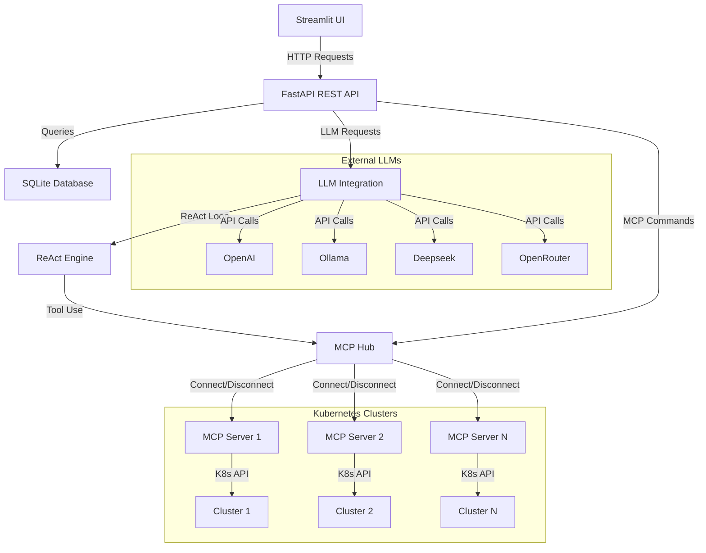
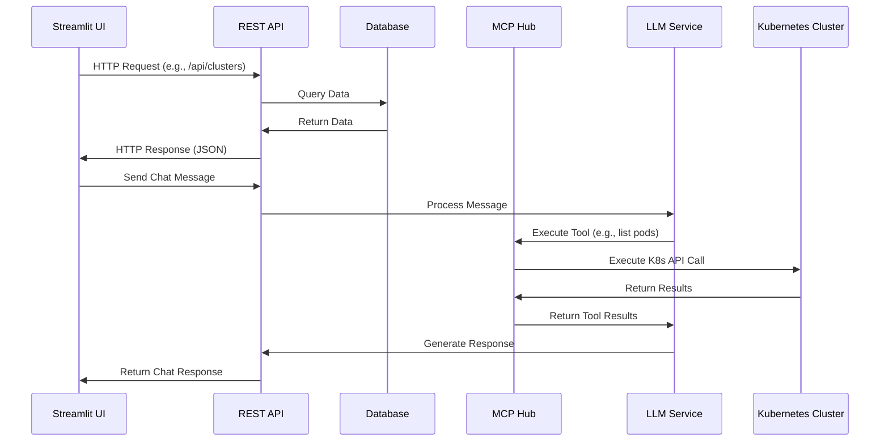
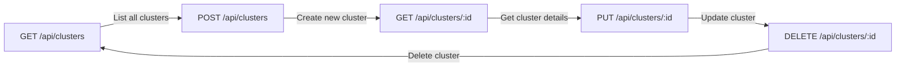
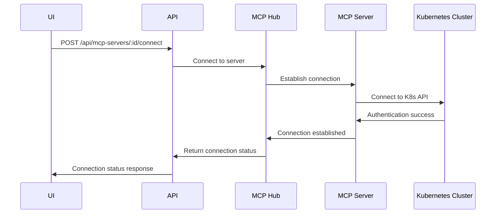
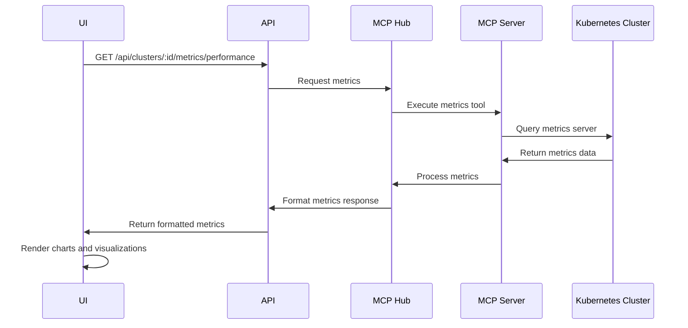
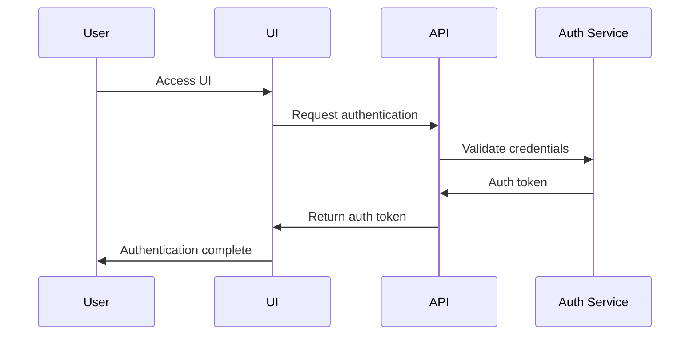

# KubeMindNexus API Architecture

This document provides an overview of the KubeMindNexus API architecture, explaining how the different components interact with each other.

## Architecture Overview



## API Layer Components

1. **REST API (FastAPI)**: Exposes HTTP endpoints for managing clusters, MCP servers, and chat interactions.
2. **Database Layer**: Stores configuration, chat history, and relationships.
3. **MCP Hub**: Manages connections to MCP servers.
4. **LLM Integration**: Provides a unified interface to multiple LLM providers.
5. **ReAct Engine**: Implements the Reasoning and Acting pattern for LLMs.

## Endpoint Categories

The API endpoints are organized into the following categories:

### Cluster Management
Endpoints for registering, configuring, and managing Kubernetes clusters.

### MCP Server Management
Endpoints for configuring and connecting to MCP servers.

### MCP Server Status
Endpoints for checking the connection status of MCP servers.

### MCP Server Tools and Resources
Endpoints for accessing tools and resources provided by connected MCP servers.

### Cluster Metrics
Endpoints for retrieving performance, health, and storage metrics from clusters.

### Kubernetes Resources
Endpoints for accessing Kubernetes resources (nodes, pods, services, PVs).

### LLM Configuration
Endpoints for configuring LLM providers and models.

### Chat Integration
Endpoints for sending messages and retrieving chat history.

## Data Flow



## REST API Structure

The API follows RESTful design principles with consistent endpoint patterns:

- **GET** for retrieving data
- **POST** for creating resources
- **PUT** for updating resources
- **DELETE** for removing resources

### Example: Cluster Resource Lifecycle



## MCP Server Connection Flow



## Metrics Data Flow



## API Authentication and Security

Authentication is currently not implemented but planned for future versions. The typical authentication flow will be:



## Error Handling

The API implements consistent error handling with appropriate HTTP status codes:

- **400**: Bad Request - Invalid parameters
- **404**: Not Found - Resource doesn't exist
- **500**: Internal Server Error - Server-side errors

Each error response follows a standard format:

```json
{
  "detail": "Error message describing the issue"
}
```

## API Versioning Strategy

While versioning is not currently implemented, future API versions will follow this pattern:

```
/api/v1/clusters
/api/v2/clusters
```

This allows for backward compatibility while introducing new features.
