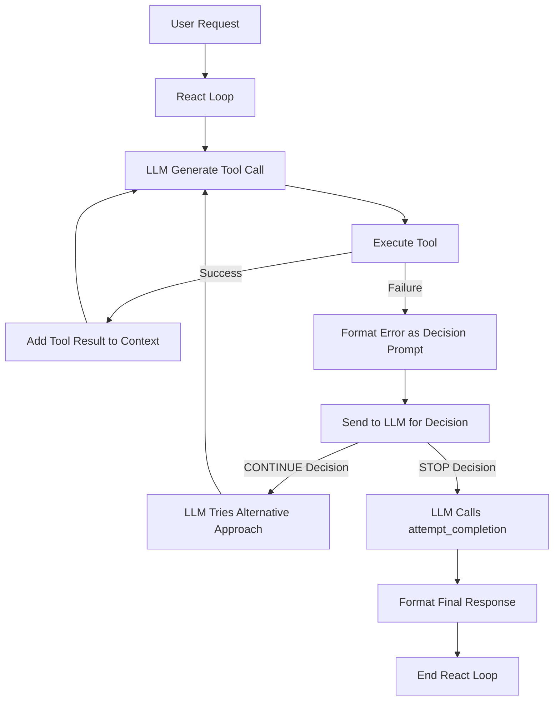

# Enhanced Error Handling in KubeMindNexus React Loop

This document describes the design and implementation of enhanced error handling in the KubeMindNexus React loop. This enhancement allows the LLM to decide whether to continue or stop the React loop when a tool execution returns an error or failure message.

## Overview

When working with complex operations involving Kubernetes clusters and external tools, errors are inevitable. The enhanced error handling system is designed to:

1. Provide structured information about errors to the LLM
2. Allow the LLM to analyze the error and decide whether it's fatal or can be worked around
3. Enable intelligent recovery through alternative approaches
4. Improve the user experience by providing clearer explanations of errors and next steps

## Implementation

The implementation spans two main components:

1. **React Loop (`react.py`)**: Modified to provide structured error prompts to the LLM
2. **System Prompt (`system.py`)**: Updated to include guidance on how to handle errors

### React Loop Enhancement

In the main execution loop, when a tool fails, the system now formats a special decision prompt that explicitly asks the LLM whether to continue or stop based on the nature of the error:

```python
if not success:
    error_message = f"Error executing tool {tool_name}: {tool_result}"
    logger.error(error_message)
    
    # Create a more structured message that guides the LLM's decision
    decision_prompt = (
        f"A tool execution error occurred:\n"
        f"Tool: {tool_name}\n"
        f"Error: {tool_result}\n\n"
        f"Based on this error, you have two options:\n"
        f"1. CONTINUE: If you think this error is non-fatal and you can try an alternative approach\n"
        f"2. STOP: If you think this error prevents task completion and you should provide a final response\n\n"
        f"Respond with either:\n"
        f"- To continue: Explain your alternative approach and proceed with another tool call\n"
        f"- To stop: Use the attempt_completion tool with an explanation of why the task cannot be completed"
    )
    
    # Add to conversation history
    tool_messages.append({
        "role": "assistant",
        "content": response_text
    })
    
    tool_messages.append({
        "role": "user",
        "content": decision_prompt
    })
```

This approach explicitly prompts the LLM to make a decision about how to proceed, rather than simply passing the error along. The LLM can then:

1. Choose to continue by explaining an alternative approach and making another tool call
2. Choose to stop by using the attempt_completion tool with an explanation

### System Prompt Enhancements

The system prompt was enhanced in two key areas:

#### 1. React Loop Guidance

Added a specific "ERROR HANDLING" section to the React loop guidance:

```
5. ERROR HANDLING: Respond appropriately to tool execution errors
   - When a tool execution fails, analyze whether the error is fatal to task completion
   - For non-fatal errors, propose alternative approaches or tools to achieve the goal
   - For fatal errors that prevent task completion, use the attempt_completion tool to explain
     the issues encountered and provide any partial results or alternative suggestions
   - Be specific about why an error occurred and how it impacts the overall task
```

#### 2. Tool Usage Guidance

Added error handling guidelines to the tool usage section:

```
*<< ERROR HANDLING GUIDELINES >>*
When a tool execution returns an error:
1. Analyze the error details carefully
2. Determine if the error is fatal to task completion or can be worked around
3. For non-fatal errors:
   - Explain your alternative approach
   - Try a different tool or parameters
   - Continue working toward task completion
4. For fatal errors:
   - Use the attempt_completion tool
   - Explain what went wrong and why the task cannot be completed
   - Provide any partial results or alternative suggestions
```

## Error Handling Flow

The enhanced error handling system follows this general flow:



## Example Error Scenarios

### Non-Fatal Error Example

1. User asks to get pod information from a Kubernetes cluster
2. LLM calls a tool to list pods in a specific namespace
3. Tool fails because namespace doesn't exist
4. LLM receives error decision prompt
5. LLM determines this is non-fatal and decides to:
   - First create the namespace
   - Then retry the pod listing operation
6. Task completes successfully

### Fatal Error Example

1. User asks to deploy an application to Kubernetes
2. LLM calls a tool to create a deployment
3. Tool fails due to insufficient cluster permissions
4. LLM receives error decision prompt
5. LLM determines this is a fatal error (permissions cannot be fixed by the tool)
6. LLM calls the attempt_completion tool with an explanation:
   - Why the operation failed
   - What permissions would be needed
   - Alternative approaches the user might consider

## Benefits of Enhanced Error Handling

1. **Intelligent Recovery**: The LLM can make informed decisions about when to retry vs. when to stop
2. **Better User Experience**: Users get appropriate responses based on error severity
3. **Reduced Unnecessary Iterations**: The loop stops when appropriate rather than continuing with futile attempts
4. **Clearer Error Communication**: Users receive more informative explanations about what went wrong
5. **Increased Autonomy**: The LLM can independently handle more error scenarios

## Design Considerations

Several factors influenced this design:

1. **Explicit Decision Prompt**: By explicitly asking the LLM to make a decision, we ensure it consciously evaluates the error rather than possibly ignoring it.
2. **Structured Format**: The prompt follows a clear structure to help the LLM understand its options.
3. **Clear Guidance**: The system prompt updates ensure the LLM knows how to respond to these prompts.
4. **Integration with attempt_completion**: Fatal errors are naturally directed to the existing task completion mechanism.

## Future Improvements

Potential enhancements to this system could include:

1. Error categorization to help the LLM better understand different types of errors
2. Specialized handling for common error patterns
3. Learning from past error handling decisions to improve future recommendations
4. User preferences for error handling (e.g., being more or less conservative about stopping)

## Conclusion

The enhanced error handling system in KubeMindNexus significantly improves the robustness of the React loop by allowing the LLM to intelligently decide whether to continue or stop based on error conditions. This approach results in more efficient task completion, better error recovery, and an improved user experience when errors are encountered.
