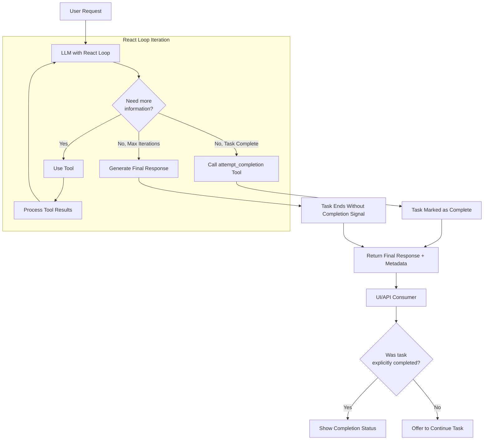

# Task Completion Design in KubeMindNexus React Loop

This document explains the implementation of the task completion mechanism in the KubeMindNexus React loop, inspired by the Cline plugin's approach.

## Overview

The React (Reasoning and Acting) loop is a pattern where an LLM iteratively:
1. Reasons about a problem
2. Takes actions through tools
3. Observes results
4. Plans next steps

A key challenge in this pattern is determining when a task is complete. The implementation adds an explicit mechanism for the LLM to signal task completion.

## Implementation Components

The task completion mechanism consists of several key components:

### 1. ATTEMPT_COMPLETION_TOOL_NAME Constant

```python
# In constants.py
ATTEMPT_COMPLETION_TOOL_NAME = "attempt_completion"
```

This constant ensures consistent reference to the tool name throughout the codebase.

### 2. Tool Definition Module

```python
# In prompts/attempt_completion.py
from ..constants import ATTEMPT_COMPLETION_TOOL_NAME

ATTEMPT_COMPLETION_TOOL_DEFINITION = {
    "name": ATTEMPT_COMPLETION_TOOL_NAME,
    "description": "Use this tool when you've completed the user's request and want to provide a final response.",
    "inputSchema": {
        "type": "object",
        "properties": {
            "result": {
                "type": "string",
                "description": "A comprehensive final response that summarizes what was accomplished."
            },
            "command": {
                "type": "string",
                "description": "Optional CLI command to demonstrate the result."
            }
        },
        "required": ["result"]
    }
}

def get_attempt_completion_tool() -> dict:
    """Get the attempt_completion tool definition."""
    return ATTEMPT_COMPLETION_TOOL_DEFINITION
```

This module defines the tool's structure and provides a function to retrieve it.

### 3. System Prompt Integration

In `system.py`, the tool is added to the system prompt sent to the LLM:

```python
def generate_system_prompt(...):
    # ...
    
    # Add attempt_completion tool to available tools
    attempt_completion_tool = get_attempt_completion_tool()
    available_tools_with_completion = available_tools
    available_tools_with_completion += "\n\n## TASK COMPLETION TOOLS\n"
    available_tools_with_completion += f"\nTool: {attempt_completion_tool['name']}\n"
    available_tools_with_completion += f"Description: {attempt_completion_tool['description']}\n"
    
    # Add arguments description
    available_tools_with_completion += "Arguments:\n"
    for param_name, param_info in attempt_completion_tool['inputSchema']['properties'].items():
        req_marker = " (required)" if param_name in attempt_completion_tool['inputSchema']['required'] else ""
        available_tools_with_completion += f"- {param_name}: {param_info['description']}{req_marker}\n"
    
    # Add tool usage guidance
    prompt_parts.append("AVAILABLE TOOLS:\n" + available_tools_with_completion)
    # ...
```

This ensures the LLM knows about the task completion tool and how to use it.

### 4. ReactLoop Class Enhancements

The `ReactLoop` class was enhanced with:

- New tracking attributes:
  ```python
  # Task completion tracking
  self.task_completed = False
  self.completion_result = None
  ```

- Detection of the attempt_completion tool call:
  ```python
  # Check for attempt_completion tool
  if tool_name == ATTEMPT_COMPLETION_TOOL_NAME:
      # This is a task completion signal
      logger.info("Detected attempt_completion tool call, completing task")
      
      # Get the completion result
      self.task_completed = True
      self.completion_result = tool_args.get("result", "Task completed successfully.")
      
      # Set the final response from the completion result
      final_response = self.completion_result
      
      # Add command execution logic if provided
      command = tool_args.get("command")
      if command:
          logger.info(f"Completion includes command to demonstrate result: {command}")
      
      # Log the completion
      tool_messages.append({
          "role": "assistant",
          "content": f"I've completed the task: {self.completion_result}"
      })
      
      # Break the loop as the task is complete
      break
  ```

- Enhanced return metadata from the `run()` method:
  ```python
  # Create metadata dictionary with execution info
  metadata = {
      "task_completed": self.task_completed,
      "completion_result": self.completion_result,
      "iterations": iteration,
      "execution_time": time.time() - start_time,
      "tool_count": len(tool_messages) // 2
  }
  
  # Return the final response, chat ID, and metadata
  return final_response, chat_id, metadata
  ```

## Task Completion Flow

The complete task completion flow now works as follows:



The flow process works as follows:

1. The LLM receives a user request and processes it through the React loop.
2. As the LLM uses tools and processes results, it builds its understanding.
3. When the LLM determines it has fully addressed the user's request, it calls the `attempt_completion` tool.
4. The ReactLoop detects this tool call and:
   - Marks the task as completed
   - Captures the final response
   - Breaks out of the iteration loop
   - Returns comprehensive metadata about the execution
5. Calling systems can use the `task_completed` flag to know if the task was explicitly marked as completed or if it ended due to other conditions (like reaching max iterations).

## Potential UI Enhancements

While not implemented in this update, the task completion design enables several UI enhancements:

1. Different styling for completed tasks vs. ongoing conversations
2. Providing a "Continue this task" option for completed tasks
3. Automatically executing demonstration commands when provided
4. Displaying task statistics (iterations, execution time, tool usage)

## Comparison to Cline's Implementation

This implementation was inspired by Cline's approach but adapted for KubeMindNexus's architecture:

- Both use an explicit signal from the LLM to mark task completion
- Both capture a comprehensive final response and optional command
- Cline's implementation has additional user feedback handling
- KubeMindNexus implementation focuses on providing rich metadata for consumers

## Future Enhancements

Potential future enhancements could include:

1. User feedback mechanisms similar to Cline's implementation
2. Command execution service for demonstration commands
3. Progress tracking during long-running tasks
4. Task persistence and resumption
